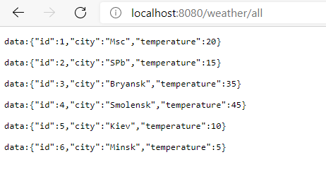
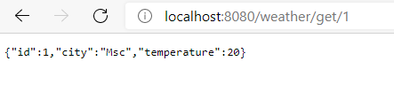
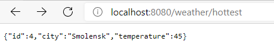
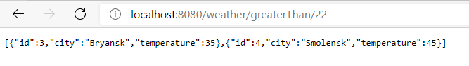

# weather_reactive
### Description of the project.
This is a simple demo weather app which includes implementation example reactive programming on ***WebFlux***. We can get list of weathers, also max temperature and filter them by given min parameter.

### Used technologies
- Gradle
- Spring (boot / WebFlux).

### Functionality REST API
1. /all - get the forecast in all cities:
   
   
   

2. /get/{id} - get a forecast for a specific city:
   
   
   

3. /hottest - get the forecast in the city with the maximum temperature:
   
   

4. /greaterThan/{temp} - get the forecast in cities where the temperature is higher than the specified one:
   

| command                               | request                                                           | response                                                                                                                                     |
|---------------------------------------|------------------------------------------------------------------|-------------------------------------------------------------------------------------------------------------------------------------------|
| get the forecast in all cities      | GET ```https://sitename/all```                                       | Status code: ```200``` Header: ```"Content-Type: text/event-stream"```  Body: ```[{"id":"", "city":"", "temperature":""}]``` |
| get a forecast for a specific city  | GET ```https://sitename/get/{id}```                                  | Status code: ```200``` Header: ```"Content-Type: application/json"```  Body: ```{{"id":"", "city":"", "temperature":""}}```                                            |
| get the forecast in the city with the maximum temperature | GET ```https://sitename/hottest``` | Status code: ```200``` Header: ```"Content-Type: application/json"``` Body: ```{"id":"", "city":"", "temperature":""}```                                                                              |
| get the forecast in cities where the temperature is higher than the specified one | GET ```https://sitename/greaterThan/{val}``` | Status code: ```200``` Header: ```"Content-Type: text/event-stream"``` Body: ```[{"id":"", "city":"", "temperature":""}]```

#### Contacts
dmstrannnik@bk.ru